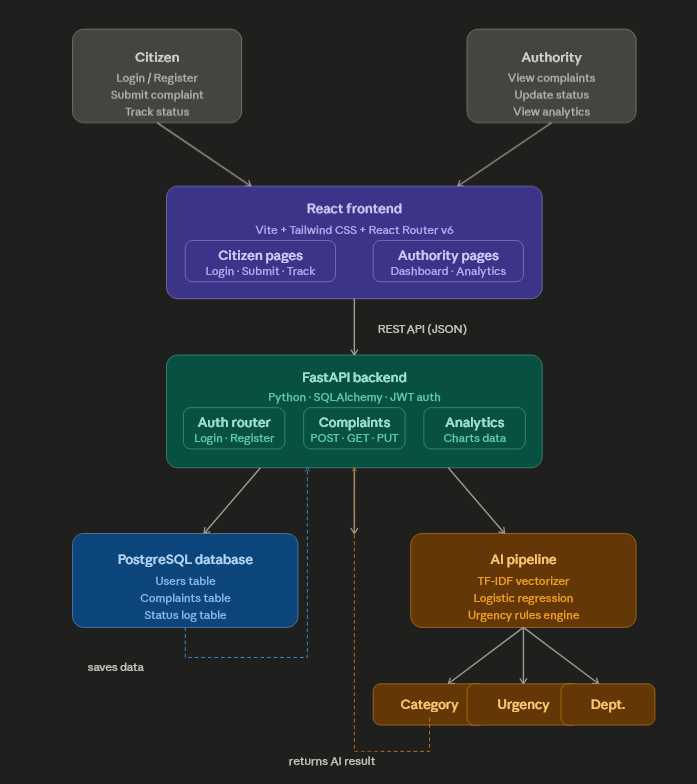
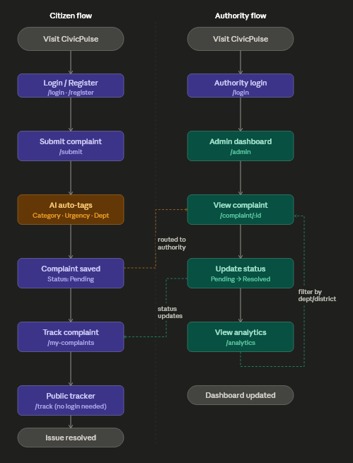

# CivicPulse
AI-powered citizen grievance intelligence system, automatically categorizes, prioritizes, and 
routes civic complaints to the correct municipal department
 
Built for **UNBOUND '26** · FOSS Club PU · MIT License 

## Problem 
Citizens in urban India lack a reliable and transparent way to report and track local civic issues.
Current municipal portals are fragmented and divided by department, and they provide no feedback after submission. 
  
Problems like potholes, broken streetlights, garbage buildup, water leaks, and sewage overflow 
remain unresolved. This isn't due to a lack of resources but happens because complaints are 
manually handled, often duplicated, and hard to prioritize on a large scale. 

## Solution
CivicPulse is an open-source, AI-powered grievance platform that: 
- Allows citizens to submit complaints with location and photo evidence
- Automatically categorizes complaint types using NLP
- Assigns urgency levels (Low, Medium, High)
- Routes complaints to the proper municipal  department
- Offers real-time public status visibility
- Provides authorities with an analytics dashboard to identify problem areas

 ## Architecture



## How a complaint flows through the system

1. Citizen submits complaint text via React form
2. FastAPI receives it and calls the AI pipeline
3. Scikit-Learn classifies → returns Category, Urgency, Department
4. All fields saved to PostgreSQL database
5. Authority sees complaint on dashboard
6. Authority updates status → Pending to Resolved
7. Citizen tracks status on Public Tracker

   
## Citizen journey

    
## Tech Stack

| Component | Tool | Purpose |
|-----------|------|---------|
| Frontend framework | React 18 + Vite | Citizen and authority UI |
| Styling | Tailwind CSS | Responsive design |
| Routing | React Router v6 | Page navigation |
| Charts | Recharts | Analytics dashboard |
| Backend | FastAPI (Python) | REST API layer |
| Database | PostgreSQL 15 | Data storage |
| ORM | SQLAlchemy | DB models and queries |
| Auth | JWT (python-jose) | Citizen and authority login |
| AI / ML | Scikit-Learn | Complaint classification |
| Vectorizer | TF-IDF | Text feature extraction |
| Maps | OpenStreetMap + Leaflet.js | Location picker and heatmap |
| Version control | GitHub | Collaboration |
| License | MIT | FOSS compliance |

## Project Structure

|| Folder | Purpose |
|--------|---------|
| `backend/app/ai/` | Classifier, urgency scoring, department routing |
| `backend/app/routers/` | API endpoints — auth, complaints, analytics |
| `backend/tests/` | Unit tests |
| `frontend/src/components/` | Shared UI components |
| `frontend/src/pages/citizen/` | Login, Register, Submit, Tracker, Public Tracker |
| `frontend/src/pages/authority/` | Admin Dashboard, Analytics, Complaint Detail |
| `ml/data/` | Training dataset (CSV) |
| `ml/models/` | Saved trained model (.pkl) |
| `ml/notebooks/` | Model development notebook |
| `docs/` | Architecture, API reference, AI attributions |

## Pages

| Route | Page | Access |
|-------|------|--------|
| `/login` | Login | Public |
| `/register` | Register | Public |
| `/track` | Public Complaint Tracker | Public |
| `/submit` | Submit Complaint | Citizen |
| `/my-complaints` | My Complaints | Citizen |
| `/admin` | Authority Dashboard | Authority |
| `/analytics` | Analytics | Authority |
| `/complaint/:id` | Complaint Detail | Authority |

## Team

| Name | Role | GitHub |
|------|------|--------|
| Susmittha | AI / ML | @susmittha21 |
| Jeevadharshini | Backend | @jeevadharshini25 |
| Mathivathana | Frontend — Citizen UI | @mathi-vathana-06 |
| Madhuvanthi | Frontend — Authority UI + DevOps | @madhu-vanthi-2517 |

 ## Demo Flow
 1. Citizen logs in and submits a complaint.
 2. AI quickly tags it with category, urgency, and department.
 3. Complaint shows up on the authority dashboard.
 4. Authority updates the status from pending to resolved.
 5. Analytics page shows live data updates.
   
## Setup

### Prerequisites
- Python 3.10+
- Node.js 18+
- PostgreSQL 15+

### Clone the repo
```bash
git clone https://github.com/madhu-vanthi-2517/civicpulse.git
cd civicpulse
```
## Backend
```bash
cd backend
pip install -r requirements.txt
cp .env.example .env
# Edit .env with your PostgreSQL credentials
uvicorn main:app --reload
```
### Frontend
```bash
cd frontend
npm install
npm run dev
```
### Test accounts
_Will be added before final submission._

## Demo Video
_Will be added before final submission._

## License
This project is licensed under the MIT License.
See [LICENSE](./LICENSE) for details.

## AI Attributions
All AI tool usage is documented in [docs/ai_attributions.md](./docs/ai_attributions.md)
as required by UNBOUND '26 Article VI.
